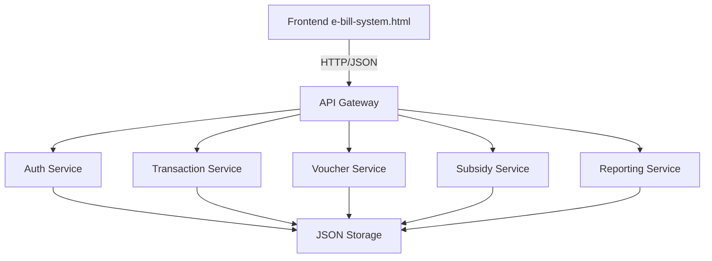

# Fertilizer Tracking E-Bill System - Architecture Plan

## 1. System Overview and Goals

### 1.1 System Purpose

The Fertilizer Tracking E-Bill System is a comprehensive digital platform designed to track fertilizer distribution, manage subsidies, and monitor Nutrient Use Efficiency (NUE) across the agricultural supply chain. The system implements best practices from international policy frameworks including the Learning from Asia Report, India's e-Bill system (p.104), and China's STFFT (p.43).

### 1.2 Core Objectives

- **Subsidy Management**: Track and distribute fertilizer subsidies from manufacturer to farmer
- **Transaction Tracking**: Maintain immutable records of all fertilizer transactions
- **NUE Monitoring**: Monitor and improve Nutrient Use Efficiency across regions
- **Role-Based Access**: Provide differentiated interfaces for Farmers, Dealers, Officers, and Administrators
- **Compliance**: Ensure adherence to international fertilizer tracking standards

### 1.3 Current System Analysis

The existing system comprises:

| Component | Technology | Purpose |
|-----------|------------|---------|
| Frontend | HTML/CSS/JS | Premium dashboard with role-based access |
| Backend | Python | Subsidy report generation |
| Data | JSON | Sample transaction storage |
| Directives | Markdown | SOPs for system operation |

---

## 2. Data Models

### 2.1 User Model

```json
{
  "id": "uuid",
  "phone": "01712345678",
  "password_hash": "bcrypt_hash",
  "role": "farmer|dealer|officer|admin",
  "name": "Full Name",
  "kyc_level": 1|2|3,
  "kyc_verified": true|false,
  "blockchain_address": "optional_address",
  "region": "district_upazila",
  "created_at": "ISO8601",
  "updated_at": "ISO8601"
}
```

**KYC Levels**:
- Level 1: Phone verification
- Level 2: NID verification
- Level 3: Full biometric verification

### 2.2 Transaction Model

```json
{
  "id": "uuid",
  "transaction_type": "purchase|voucher_redemption|subsidy_claim",
  "farmer_id": "uuid",
  "dealer_id": "uuid",
  "fertilizer_type": "urea|dap|mop|npk|gypsum|zinc",
  "quantity_kg": 50,
  "unit_price": 30,
  "subsidy_amount": 400,
  "total_amount": 1500,
  "voucher_id": "uuid|null",
  "status": "pending|approved|rejected|completed",
  "blockchain_hash": "sha256_hash",
  "created_at": "ISO8601",
  "approved_by": "officer_id|null",
  "approved_at": "ISO8601|null"
}
```

### 2.3 Voucher Model

```json
{
  "id": "uuid",
  "voucher_code": "VCH-2024-XXXXX",
  "farmer_id": "uuid",
  "subsidy_percentage": 50,
  "max_amount": 2000,
  "fertilizer_types": ["urea", "dap"],
  "valid_from": "ISO8601",
  "valid_until": "ISO8601",
  "status": "active|used|expired|cancelled",
  "used_transaction_id": "uuid|null",
  "created_by": "admin_id",
  "created_at": "ISO8601"
}
```

### 2.4 Subsidy Model

```json
{
  "id": "uuid",
  "fertilizer_type": "urea",
  "subsidy_percentage": 40,
  "per_kg_rate": 12,
  "region": "national|district_specific",
  "effective_from": "ISO8601",
  "effective_until": "ISO8601|null",
  "policy_reference": "asia_report_p104|india_ebill_p104",
  "status": "active|archived",
  "created_by": "admin_id",
  "created_at": "ISO8601"
}
```

### 2.5 Soil Health Model

```json
{
  "id": "uuid",
  "farmer_id": "uuid",
  "region": "district_upazila",
  "ph_level": 6.5,
  "nitrogen_content": "low|medium|high",
  "phosphorus_content": "low|medium|high",
  "potassium_content": "low|medium|high",
  "organic_matter_percentage": 2.5,
  "recommended_fertilizers": ["urea_30kg", "dap_20kg"],
  "test_date": "ISO8601",
  "lab_name": "Soil Testing Lab Name",
  "report_url": "file_path"
}
```

### 2.6 NUE (Nutrient Use Efficiency) Model

```json
{
  "id": "uuid",
  "region": "district",
  "reporting_period": "2024-q1",
  "target_nue_percentage": 50,
  "actual_nue_percentage": 48.5,
  "fertilizer_distributed_kg": 50000,
  "crop_production_tons": 25000,
  "efficiency_rating": "improving|declining|stable",
  "calculated_at": "ISO8601"
}
```

---

## 3. API Endpoints Design

### 3.1 Authentication Endpoints

| Method | Endpoint | Description | Access |
|--------|----------|-------------|--------|
| POST | /api/auth/login | User login | Public |
| POST | /api/auth/logout | User logout | Authenticated |
| GET | /api/auth/me | Get current user | Authenticated |
| PUT | /api/auth/password | Change password | Authenticated |

### 3.2 User Management Endpoints

| Method | Endpoint | Description | Access |
|--------|----------|-------------|--------|
| GET | /api/users | List all users | Admin |
| POST | /api/users | Create new user | Admin |
| GET | /api/users/:id | Get user details | Admin/Officer |
| PUT | /api/users/:id | Update user | Admin |
| DELETE | /api/users/:id | Delete user | Admin |
| GET | /api/farmers | List farmers | Dealer/Officer |
| GET | /api/dealers | List dealers | Officer/Admin |

### 3.3 Transaction Endpoints

| Method | Endpoint | Description | Access |
|--------|----------|-------------|--------|
| GET | /api/transactions | List transactions | Role-based |
| POST | /api/transactions | Create transaction | Farmer/Dealer |
| GET | /api/transactions/:id | Get transaction details | Owner/Officer |
| PUT | /api/transactions/:id/approve | Approve transaction | Officer |
| PUT | /api/transactions/:id/reject | Reject transaction | Officer |
| GET | /api/transactions/report | Generate report | Officer/Admin |

### 3.4 Voucher Endpoints

| Method | Endpoint | Description | Access |
|--------|----------|-------------|--------|
| GET | /api/vouchers | List vouchers | Role-based |
| POST | /api/vouchers | Create voucher | Admin |
| GET | /api/vouchers/:id | Get voucher details | Owner |
| PUT | /api/vouchers/:id/redeem | Redeem voucher | Dealer |
| POST | /api/vouchers/validate | Validate voucher code | Dealer |

### 3.5 Subsidy Endpoints

| Method | Endpoint | Description | Access |
|--------|----------|-------------|--------|
| GET | /api/subsidies | List subsidies | Officer/Admin |
| POST | /api/subsidies | Create subsidy rate | Admin |
| GET | /api/subsidies/rates/:type | Get current rate | All |
| GET | /api/subsidies/calculate | Calculate subsidy | Dealer |

### 3.6 Soil Health Endpoints

| Method | Endpoint | Description | Access |
|--------|----------|-------------|--------|
| GET | /api/soil-tests | List soil tests | Farmer/Officer |
| POST | /api/soil-tests | Submit soil test | Farmer |
| GET | /api/soil-tests/:id | Get test results | Owner/Officer |
| GET | /api/soil-tests/recommendations | Get recommendations | Farmer |

### 3.7 NUE Monitoring Endpoints

| Method | Endpoint | Description | Access |
|--------|----------|-------------|--------|
| GET | /api/nue | Get NUE data | Officer/Admin |
| GET | /api/nue/regional/:region | Get regional NUE | Officer |
| POST | /api/nue/calculate | Calculate NUE | System |
| GET | /api/nue/targets | Get NUE targets | All |

### 3.8 Report Endpoints

| Method | Endpoint | Description | Access |
|--------|----------|-------------|--------|
| GET | /api/reports/subsidy | Subsidy distribution | Admin |
| GET | /api/reports/transactions | Transaction summary | Officer |
| GET | /api/reports/regional | Regional report | Admin |
| POST | /api/reports/generate | Generate custom report | Admin |

---

## 4. Storage Layer Design

### 4.1 JSON-Based File Storage Structure

```
storage/
├── users/
│   ├── index.json          # User index for quick lookup
│   └── {id}.json           # Individual user files
├── transactions/
│   ├── index.json          # Transaction index
│   ├── {id}.json           # Individual transaction
│   └── by_farmer/{id}.json # Farmer transaction history
├── vouchers/
│   ├── index.json          # Voucher index
│   └── {id}.json           # Individual voucher
├── subsidies/
│   ├── rates.json          # Current subsidy rates
│   └── history.json        # Subsidy rate history
├── soil_tests/
│   ├── index.json          # Soil test index
│   └── {id}.json           # Individual test results
├── nue/
│   ├── regional.json       # Regional NUE data
│   └── targets.json        # NUE targets
└── audit/
    └── logs.json           # System audit logs
```

### 4.2 Index File Structure

```json
// users/index.json
{
  "last_updated": "ISO8601",
  "total_count": 150,
  "by_role": {
    "farmer": 100,
    "dealer": 30,
    "officer": 15,
    "admin": 5
  },
  "ids": ["uuid1", "uuid2", "uuid3"]
}
```

### 4.3 Data Integrity Measures

- **Hash Verification**: Each file includes a SHA-256 hash for integrity
- **Version Control**: JSON files include version numbers
- **Backup System**: Automatic backups to `.backup/` directory
- **Lock Files**: `.lock` files for concurrent access prevention

---

## 5. Frontend-Backend Integration Plan

### 5.1 Integration Architecture



### 5.2 API Communication Protocol

**Request Format**:
```json
{
  "action": "endpoint_name",
  "method": "GET|POST|PUT|DELETE",
  "data": {},
  "auth_token": "jwt_token"
}
```

**Response Format**:
```json
{
  "success": true,
  "data": {},
  "message": "Success message",
  "timestamp": "ISO8601"
}
```

**Error Response**:
```json
{
  "success": false,
  "error": {
    "code": "ERROR_CODE",
    "message": "Human readable message"
  },
  "timestamp": "ISO8601"
}
```

### 5.3 Frontend Service Layer

```javascript
// api/services/UserService.js
class UserService {
    static login(phone, password, role) { }
    static getProfile() { }
    static updateProfile(data) { }
    static getFarmers() { }
    static getDealers() { }
}

// api/services/TransactionService.js
class TransactionService {
    static getAll(filters) { }
    static create(transaction) { }
    static approve(id) { }
    static reject(id, reason) { }
    static getReport(params) { }
}

// api/services/VoucherService.js
class VoucherService {
    static validate(code) { }
    static redeem(id, transactionId) { }
    static getByFarmer(farmerId) { }
}

// api/services/SubsidyService.js
class SubsidyService {
    static calculate(type, quantity) { }
    static getRates() { }
    static getHistory() { }
}
```

### 5.4 State Management

- **User State**: Current user, role, permissions
- **Transaction State**: Active transactions, pending approvals
- **Cache State**: Frequently accessed data (subsidy rates, NUE targets)
- **UI State**: Current tab, filters, pagination

---

## 6. Security Considerations

### 6.1 Authentication & Authorization

| Feature | Implementation |
|---------|----------------|
| Password Hashing | bcrypt with salt |
| Session Management | JWT tokens with expiry |
| Role-Based Access | Middleware permission checks |
| KYC Verification | Multi-level verification |

### 6.2 Data Security

| Feature | Implementation |
|---------|----------------|
| Data Encryption | AES-256 for sensitive fields |
| File Permissions | Read-only for data files |
| Audit Logging | All actions logged with timestamp |
| Input Validation | Sanitize all user inputs |

### 6.3 API Security

| Feature | Implementation |
|---------|----------------|
| Rate Limiting | 100 requests/minute per user |
| CORS | Whitelist allowed origins |
| HTTPS | Enforce SSL/TLS |
| CSRF Protection | Token-based validation |

### 6.4 Blockchain Integration

- Transaction hashes stored for immutability
- Reference hashes from China STFFT (p.43) for fertilizer tracking
- India e-Bill compliance (p.104) for subsidy verification

---

## 7. Project File Structure

```
h:/state/e bill system/
├── e-bill-system.html              # Main frontend application
├── plans/
│   └── architecture.md            # This document
├── execution/
│   ├── process_subsidies.py       # Subsidy report generation
│   ├── api_server.py              # Python API server
│   ├── auth_handler.py            # Authentication handlers
│   └── data_manager.py            # JSON data operations
├── storage/                       # JSON-based data storage
│   ├── users/
│   ├── transactions/
│   ├── vouchers/
│   ├── subsidies/
│   ├── soil_tests/
│   ├── nue/
│   └── audit/
├── .tmp/
│   └── demo_data.json             # Sample demo data
├── directives/
│   ├── 00_master_directive.md     # Master directive
│   ├── ui_updates.md              # UI guidelines
│   └── generate_subsidy_report.md # Report SOP
└── README.md                      # System documentation
```

---

## 8. Implementation Roadmap

### Phase 1: Foundation
- [ ] Set up API server infrastructure
- [ ] Implement JSON storage layer
- [ ] Create user authentication system
- [ ] Build basic transaction endpoints

### Phase 2: Core Features
- [ ] Implement voucher management
- [ ] Build subsidy calculation engine
- [ ] Create soil test tracking
- [ ] Implement NUE monitoring

### Phase 3: Integration
- [ ] Connect frontend to backend APIs
- [ ] Implement role-based access control
- [ ] Add blockchain hash verification
- [ ] Create reporting dashboard

### Phase 4: Compliance
- [ ] India e-Bill (p.104) compliance
- [ ] China STFFT (p.43) alignment
- [ ] Learning from Asia Report implementation
- [ ] Security audit and testing

---

## 9. Policy References

### 9.1 India e-Bill (p.104)
- Digital voucher system for fertilizer subsidy
- Real-time transaction verification
- Dealer inventory management

### 9.2 China STFFT (p.43)
- Fertilizer quality tracking
- Production-to-consumption traceability
- Regional distribution optimization

### 9.3 Learning from Asia Report
- NUE improvement targets (50% target)
- Regional efficiency monitoring
- Farmer education programs
- Soil health integration

---

## 10. Conclusion

This architecture plan provides a comprehensive framework for building a robust Fertilizer Tracking E-Bill System. The JSON-based storage layer ensures simplicity and cost-effectiveness while maintaining data integrity. The API-driven design enables seamless frontend-backend integration with proper security measures aligned to international standards.

The system design incorporates:
- **Scalability**: Modular architecture for future expansion
- **Security**: Multi-layer authentication and authorization
- **Compliance**: Alignment with international policy frameworks
- **Usability**: Role-based interfaces with multi-language support
- **Maintainability**: Clear separation of concerns and documentation
